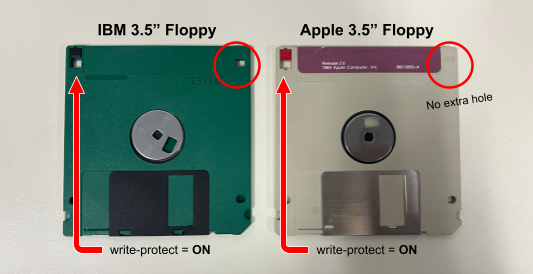

# Floppy Disk

_Last updated on July 7, 2026_

## 💾 Setting up the Drive

For 3.5” Apple and 5.25” floppies, we must extract an image from the disk using specialized equipment in the lab. For standard 3.5” floppies, we’re able to grab the carved files right off of the disk using FTK.

This workflow covers all methods, so first identify the type of floppy disk you’re working with then follow the instructions accordingly.

I am working with a...

   + [3.5" IBM](https://github.com/abbysyp/digipreslabdocs/edit/main/docs/FLOPPY.md#floppy-reader)
   + [3.5" Apple](https://github.com/abbysyp/digipreslabdocs/edit/main/docs/FLOPPY.md#kryoflux)
   + [5.25"](https://github.com/abbysyp/digipreslabdocs/edit/main/docs/FLOPPY.md#fc5025)

## 📁 Prepare Media Directory

_These instructions are adapted for the Mac machine (Princess Leia) in the Digital Preservation Lab._
   
1. For each physical disk, create an empty folder and name it the corresponding **barcode**.

6. Within the top-level barcode folder, create two additional folders called **carved_files** and **transfer_metadata**.

   
  
8. Continue to **Getting Carved Files**.

15. Continue to [Packaging and Transfer Workflow](https://github.com/abbysyp/digipreslabdocs/blob/main/docs/PACKAGING.md#packaging-and-transferring-files-to-archivematica).
   

   
