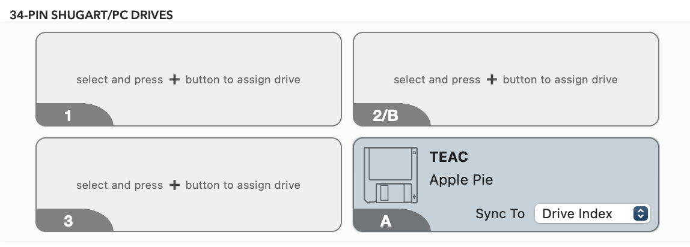

# Using Applesauce to Extract Files from a Floppy

_Last updated on July 15, 2026_

## 🍎 Setting up the Drive

work in progress

## 📁 Prepare Media Directory

_These instructions are adapted for the Mac machine (Princess Leia) in the Digital Preservation Lab._
   
1. For each physical disk, create an empty folder and name it the corresponding **barcode**.

6. Within the top-level barcode folder, create two additional folders called **carved_files** and **transfer_metadata**.

   
  
8. Continue to **Getting Carved Files**.

## 💾 Getting Carved Files

_These instructions are adapted for the Mac machine (Princess Leia) in the Digital Preservation Lab._

1. Select drive.
     + Apple Pie for IBM 3.5" floppies
  
      
2. Double-check that the yellow safety light on Applesauce is turned on. Select **Image Disk**. The progress grid should update as the disk is being read and the drive itself will light up.

15. Continue to [Packaging and Transfer Workflow](https://github.com/abbysyp/digipreslabdocs/blob/main/docs/PACKAGING.md#packaging-and-transferring-files-to-archivematica).
   

   
