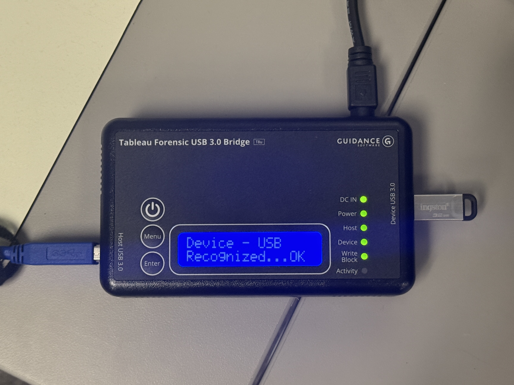

# USB or External Hard Drive 

_Last updated on November 13, 2025_

## 📁 Prepare Media Directory

_These instructions are adapted for the Windows machine (Yoda) in the Digital Preservation Lab._

1. Disconnect from the network - _this is a precaution in case we detect any viruses!_ On the back of the machine, **unplug** both the **black** and **gray** cables in the 1G and 10G slots, respectively.

   The black cable in the 1G port connects to the NAS, and the gray cable in the 10G port connects to Network 0.

   
   
4. For each physical drive, create an empty folder and name it the corresponding drive’s barcode.
6. Within the top-level barcode folder, create two additional folders called **carved_files** and **transfer_metadata**.

   
8. Continue to **Write Blocker Setup**.

## 🚫 Write Blocker Setup

_These instructions are adapted for the Tableau Forensic USB 3.0 Bridge._

1. Connect the drive to the write blocker.
   
3. Connect the write blocker via USB to the computer.
4. Connect the power supply cord to the write blocker, then plug it into an outlet. Confirm that the **DC IN** light turns green.
5. Turn on the write blocker by pressing the power button once. The **Power**, **Host**, **Device**, and **Write Block** lights should turn green and the write blocker screen should indicate that it recognizes the device. The Activity light may blink red, which is OK.

   
7. Continue to **Virus Scan**.
  
## 🦠 Virus Scan

_These instructions are adapted to use Falcon Crowdstrike Virus Scanning Software._

1. Open **Windows Security** from the Desktop Search Bar.
   
3. From the dashboard, select **Virus & threat protection**.

   
5. _Underneath_ the button that says Quick scan, select **Scan options**.

   
7. Select **Custom scan**, then choose the directory in File Explorer where the USB or hard drive files can be found.
8. Run the scan, then scroll back to **Scan options** at the top - you should see the results of the virus scan.

   
10. If all looks clear, continue to **File Transfer**.

## 🔁 File Transfer

1. From the Desktop, open **AccessData FTK Imager**.
2. Select **File → Add Evidence Item**.

   
4. Select your **Physical Drive** then click **Finish**.

   
6. Under **Evidence Tree**, click on **+** to expand the directories until you see **[root]** or **[HTE]** and click on it.

   
8. In the **File List** panel, select the files you want using **Ctrl+click**. We typically _exclude_ Slack files, apps, installers, Trash, and Recycled files.
9. Once all the files are highlighted, **right-click** and select **Export Files…**

    
11. Select **barcode → carved_files** as the destination folder then click **OK**.
12. **Right-click** the highlighted files again in FTK and select **Export File Hash List**.
13. This time, select **barcode → transfer_metadata** as the destination folder. Enter filename as _checksums_ then click **OK**.

    Essentially, we’re asking FTK to generate a csv of MD5 and SHA1 checksums for each of the carved files as early as possible. We will use this later to double check that the files haven’t changed.
14. Double check that both the carved files and checksums.csv are there.
15. Continue to [Packaging and Transfer Workflow](https://github.com/abbysyp/digipreslabdocs/blob/main/docs/PACKAGING.md#packaging-and-transferring-files-to-archivematica).
